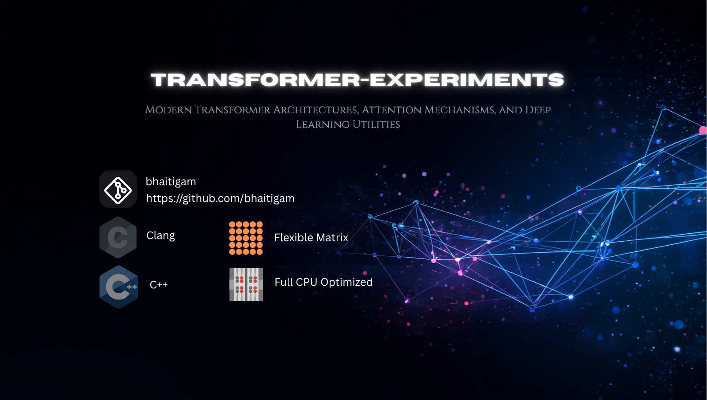

#  transformer-experiments

<div align="center">




### Modern Transformer Architectures, Attention Mechanisms, and Deep Learning Utilities

</div>

---

#  Description

This repository provides modular implementations of modern Transformer architectures, attention mechanisms, and deep learning utilities. It includes reusable components for NLP, computer vision, and LLM research, helping developers build, train, and experiment with scalable AI models efficiently.

The project is designed with clean architecture, flexibility, and research-focused experimentation in mind. It supports modern Transformer techniques including multi-head attention, positional embeddings, Flash Attention, RoPE, RMSNorm, Mixture of Experts (MoE), and efficient training workflows.

---

#  Features

-  Transformer architectures
-  Multi-head attention
-  Encoder-decoder models
-  GPT and BERT style models
-  Vision Transformers (ViT)
-  Flash Attention support
-  RoPE and ALiBi embeddings
-  PyTorch-based implementation
-  Modular and scalable structure
-  Research and production ready

---

#  Repository Structure

```bash
transformer-experiments/
│
├── images/
├── configs/
├── datasets/
├── docs/
├── examples/
├── notebooks/
├── scripts/
├── src/
│   ├── attention/
│   ├── embeddings/
│   ├── layers/
│   ├── models/
│   ├── tokenizers/
│   └── utils/
│
├── tests/
├── requirements.txt
├── setup.py
├── LICENSE
└── README.md
